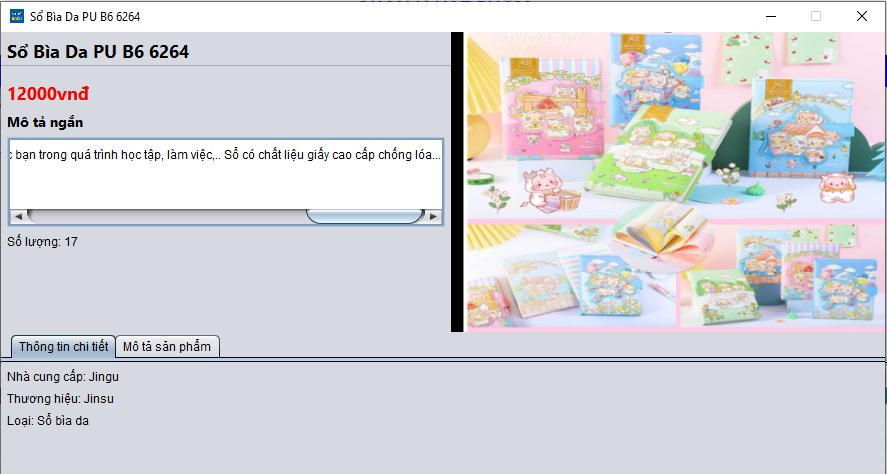

# Bookstore Management System (Java Swing + JDBC + MS SQL)

* **Login Screen**

  

* **Home Screen**

  

* **User Management Screen**

  

* **Role Management Screen**

  

* **Book/Stationery Management Screen**

  

* **Book/Stationery Detail Screen**

  

* **Customer Register Screen**

  

* **Redeem Voucher Screen**

  

* **Customer Management Screen**

  

* **Billing Screen**

  

* **Bill Management Screen**

  

* **Bill Detail Screen**

  

* **Order Management Screen**

  

  

  

* **Revenue Statistics Screen**

  

Chart

  

